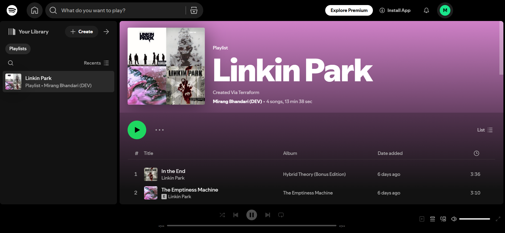
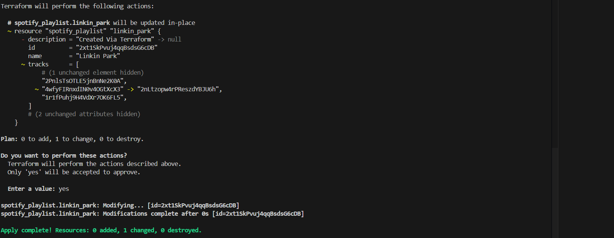
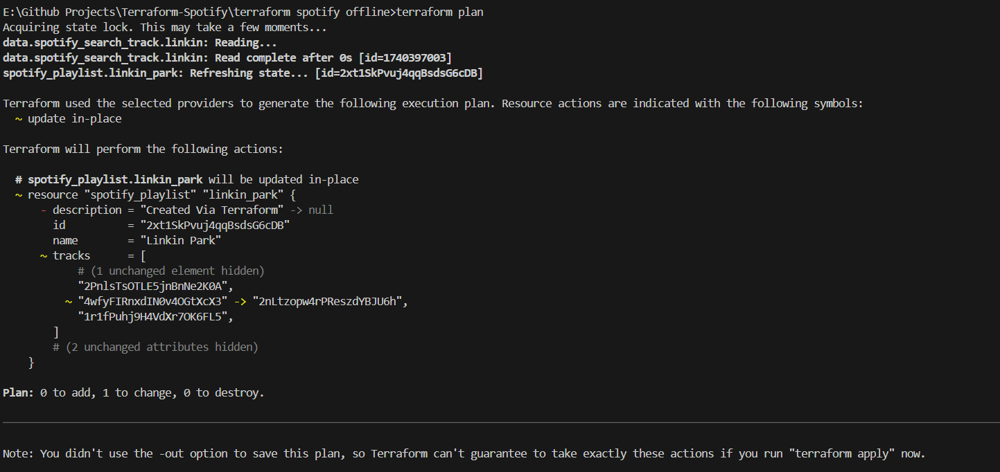
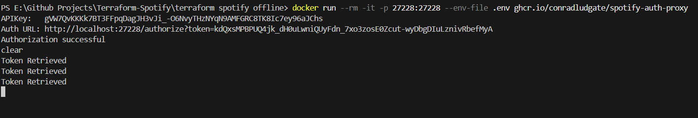

# Spotify-Terraform-Playlist-Creator

## Overview
**Spotify-Terraform-Playlist-Creator** is a project that leverages Terraform's provider functionality to interact with the Spotify API. It automates playlist creation using Terraform and runs inside a Docker container. The project utilizes OAuth2 authentication to generate an API key, which Terraform then uses to create and apply playlists to a Spotify account.






## Features
- Uses **Terraform Provider** to interact with Spotify API.
- Automates playlist creation using **Terraform plan & apply**.
- Runs inside a **Docker container**.
- Retrieves OAuth2 API keys dynamically.
- Uses a **playlist.tf** blueprint file to define playlist details.
- Utilizes a **Spotify Developer Account** to retrieve `client_id` and `client_secret`.

## How It Works
1. **Spotify OAuth2 Authentication**
   - The Docker container code interacts with the Spotify API to generate an access token.
   - This token is then passed to Terraform for authorization.
2. **Terraform Playlist Creation**
   - Terraform reads `playlist.tf`, which defines the playlist structure.
   - `terraform plan` generates the execution plan.
   - `terraform apply` creates the playlist on the linked Spotify account.
3. **Spotify API Integration**
   - The API key is dynamically fetched using OAuth2.
   - The playlist is created using Terraform's Spotify provider.

## Prerequisites
- **Spotify Developer Account** (to retrieve `client_id` and `client_secret`)
- **Terraform** installed ([Download Terraform](https://developer.hashicorp.com/terraform/downloads))
- **Docker** installed ([Get Docker](https://www.docker.com/get-started))

## Installation & Setup
### 1. Clone the Repository
```sh
git clone https://github.com/your-username/Spotify-Terraform-Playlist-Creator.git
cd Spotify-Terraform-Playlist-Creator
```

### 2. Configure Environment Variables
Create a `.env` file with the following details:
```ini
SPOTIFY_CLIENT_ID=your-client-id
SPOTIFY_CLIENT_SECRET=your-client-secret
```

### 3. Run Docker Container
```sh
docker run --rm -it -p 27228:27228 --env-file .env ghcr.io/conradludgate/spotify-auth-proxy  
```

### 4. Initialize & Apply Terraform (Additionally Downloads Terraform provider code)
```sh
terraform init
terraform plan
terraform apply
```

## Notes
- Ensure your **Spotify Developer App** has the required permissions to create playlists.
- The **OAuth2 token** may expire, requiring re-authentication.
- You can modify `playlist.tf` to create custom playlists.
